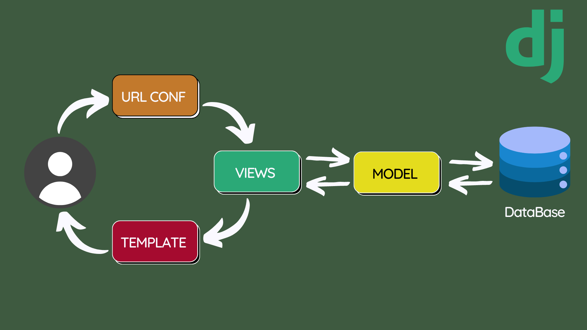

# Tugas Individu 2 : Implementasi Model-View-Template (MVT) pada Django

## Identitas Mahasiswa

**Nama**: Rafie Asadel Tarigan  
**NPM**: 2306245485  
**Kelas**: PBP - F

## Link Website

Website dapat diakses melalui:  
[https://contoh-aplikasi-pws.com](https://contoh-aplikasi-pws.com)

## Jawaban

### A. Cara Implementasi Checklist Tahapan Pengerjaan Tugas
Berikut adalah langkah-langkah implementasi checklist secara detail:

1. **Setup Kebutuhan**
   - Buat env dengan 
```bash
    python -m venv env
    env\Scripts\activate
```
   - Buat dan isi file requirements.txt dengan libraries yang ingin di install, lalu jalankan
```bash
    pip install -r requirements.txt
```

2. **Setup Proyek Django**
   - Buat proyek dengan 
```bash
  django-admin startproject asadelstore
```
   - Masuk ke direktori proyek dengan .
```bash
  cd asadelstore
```

3. **Buat Aplikasi**
   - Buat aplikasi dengan 
```bash
python manage.py startapp main
```
   - Di dalam *`asadelstore/settings.py`* lakukan perubahan dengan isi
```python
INSTALLED_APPS = [
     ...,
    'main', 
    ]
```

4. **Definisikan Model**
   - Di dalam *`main/models.py`*, buat model Product beserta fieldnya,
   - Jalankan migrasi menggunakan 
```bash
python manage.py makemigrationspython manage.py migrate
```

5. **Buat Views**
   - Di dalam *`main/views.py`* buat fungsi `show_main` untuk mengirim data sekaligus menampilkan halaman main.html
```python
    from django.shortcuts import render

    def show_main(request):
        context = {
            'npm' : '2306245485',
            'name': 'Rafie Asadel Tarigan',
            'pbp_class': 'F'
        }

        return render(request, "main.html", context)
```

6. **Tentukan URL Patterns**
   - Di dalam *`asadel/urls.py`* tambahkan kode berikut agar proyek langsung melanjutkan routing ke urlpatterns di aplikasi
```python
    urlpatterns = [
        ...
        path('', include('main.urls'))
    ]
```
   - Buat file *`main/urls.py`* dan tambahkan kode berikut agar routing langsung mengeksekusi fungsi `show_main`
```python
    from django.urls import include, path
    from .views import show_main

    urlpatterns = [
        path('', show_main, name='show_main'),
    ]
```

7. **Desain Template HTML**
   - Buat folder serta file *`main/templates/main.html`* tampilkan data dengan
```html
    ...
    </body>
    <footer>
        @ {{ name }} | NPM {{ npm }} | F - {{ pbp_class }}
    </footer>
</html>
```

### B. Alur Kerja Request dan Respon pada Django



#### Client -> URL Configuration -> Views -> Model -> BasisData
1. **Client** mengirim permintaan (request) yang akan diterima oleh URL proyek.
2. **URL Configuration** akan meneruskan permintaan ke URL aplikasi.
3. **URL** akan memeriksa daftar permintaan (URL patterns) untuk mencocokkan permintaan dari Client.
4. Jika ditemukan, URL akan mengeksekusi **View** yang terdaftar untuk permintaan tersebut.
5. **View** akan menggunakan **Model** untuk berinteraksi dengan data di **Basis Data**.
6. **Model** akan melakukan pemetaan data di **Basis Data** sesuai perintah dari View.

#### BasisData -> Model -> Views -> Template -> Client
1. Setelah perintah selesai diproses, **Model** akan mengirimkan data kembali dari **Basis Data**.
2. **View** akan menerima data dan memilih **Template** untuk menyajikan data tersebut.
3. **Template** akan menggabungkan data dan format HTML untuk menghasilkan halaman web.
4. Halaman web yang sudah jadi akan dikirimkan kembali sebagai **respon** ke **Client**.
5. **Client** menerima respon dan menampilkan hasilnya.


### C. Fungsi Git dalam Pengembangan Perangkat Lunak

1. **Version Control**
   - **Melacak Perubahan**: Git mencatat perubahan kode, memungkinkan untuk kembali ke pengerjaan sebelumnya.

2. **Collaboration**
   - **Berkolaborasi**: Memudahkan banyak pengembang bekerja pada proyek yang sama dengan mengelola perubahan dan mengatasi konflik.

3. **Branching and Merging**
   - **Branching**: Membuat cabang terpisah agar untuk pengerjaan setiap fitur dan menjaga kode utama tetap stabil.
   - **Merging**: Menggabungkan cabang kembali ke kode utama setelah suatu fitur selesai.

4. **History Tracking**
   - **Riwayat Perubahan**: Membantu dalam audit dan debugging dari semua catatan perubahan dan informasi

5. **Distributed Development**
   - **Sistem Terdistribusi**: Setiap menyalin dan memulihkan data repository ke ruang kerja lokal.

6. **Integrasi dengan Alat Lain**
   - **CI/CD dan Code Review**: Alat otomatisasi dan review kode untuk meningkatkan dan memudahkan proses pengembangan.


### D. Django Menjadi Framework Awal untuk Belajar Pengembangan Perangkat Lunak

1. **Gentle Learning Curve**
   - **Mudah Dipelajari**: Struktur proyek yang sederhana memudahkan pemula mengenal cara pembuatan perangkat lunak
2. **Python Based**
   - **Bahasa Python**: Python yang merupakan salah satu bahasa pemrograman tingkat tinggi yang mudah dikuasai
3. **Good Documention and Community**
   - **Dokumentasi**: Dokumentasi django sangat lengkap dan terstruktur
   - **Komunitas**: Sudah banyak pengembang yang menggunakan sehingga mudah mencari informasi di berbagagi platform tech
4. **Built-in Feature**
   - **Fitur Siap Pakai**: Django sudah disediakan berbagai fitur siap pakai untuk memudahkan dan mempercepat proses pengembangan

## E. Model Django Disebut ORM

ORM *(Object-Relational Mapping)* adalah teknik pengembangan perangkat lunak yang menghubungkan suatu kelas objek ke kolom, baris, dan tabel di suatu basis data menjadi sebuah data. 

Dalam Django, pengembang menggunakan bahasa pemrograman Python untuk CRUD (membuat, mengambil, memperbarui, dan menghapus) data tanpa menulis SQL secara langsung. Jadi, Django secara otomatis mengelola pemetaan data-data di basis data tersebut, sedangkan pengembang bisa fokus membuat kode pemrograman Python.
