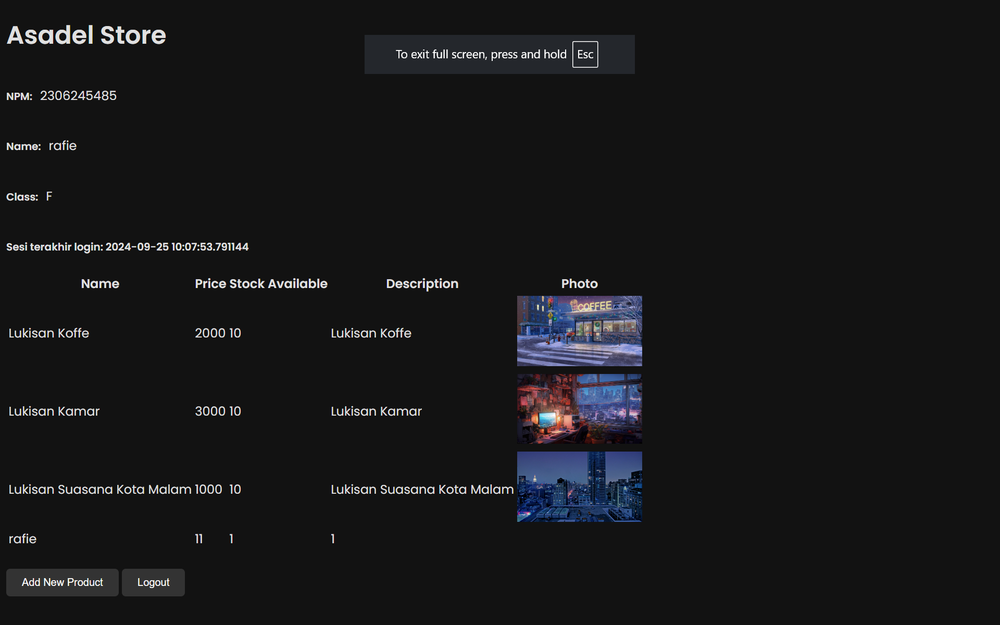
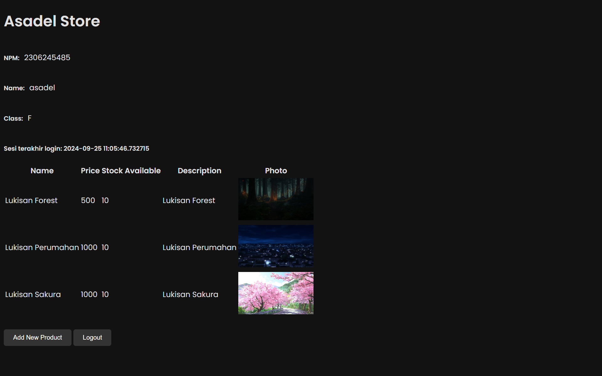

# ASADEL STORE - Tugas Individu PBP

## Daftar Isi
- [Identitas Mahasiswa](#identitas-mahasiswa)
- [Link Website](#link-website)
- [Tugas Individu 2 : Implementasi Model-View-Template (MVT) pada Django](#tugas-individu-2-implementasi-model-view-template-mvt-pada-django)
- [Tugas Individu 3 : Implementasi Form dan Data Delivery pada Django](#tugas-individu-3--implementasi-form-dan-data-delivery-pada-django)
- [Tugas Individu 4 : Implementasi Autentikasi, Season, dan Cookies pada Django](#tugas-individu-4--implementasi-autentikasi-session-dan-cookies-pada-django)
- [Tugas Individu 5 : Desain Web menggunakan HTML, CSS dan Framework CSS](#tugas-individu-5--desain-web-menggunakan-html-css-dan-framework-css)
- [Tugas 6: JavaScript dan AJAX](#tugas-6-javascript-dan-ajax)

## Identitas Mahasiswa

**Nama**: Rafie Asadel Tarigan  
**NPM**: 2306245485  
**Kelas**: PBP - F

## Link Website

Website dapat diakses melalui:  
http://rafie-asadel-asadelstore.pbp.cs.ui.ac.id/

## Tugas Individu 2 : Implementasi Model-View-Template (MVT) pada Django

### A. Cara Implementasi Checklist Tahapan Pengerjaan Tugas
Berikut adalah langkah-langkah implementasi checklist secara detail:

1. **Setup Kebutuhan**
   - Buat env dengan 
```bash
    python -m venv env
    env\Scripts\activate
```
   - Buat dan isi file requirements.txt dengan libraries yang ingin di install, lalu jalankan
```bash
    pip install -r requirements.txt
```

2. **Setup Proyek Django**
   - Buat proyek dengan 
```bash
  django-admin startproject asadelstore
```
   - Masuk ke direktori proyek dengan .
```bash
  cd asadelstore
```

3. **Buat Aplikasi**
   - Buat aplikasi dengan 
```bash
python manage.py startapp main
```
   - Di dalam *`asadelstore/settings.py`* lakukan perubahan dengan isi
```python
INSTALLED_APPS = [
     ...,
    'main', 
    ]
```

4. **Definisikan Model**
   - Di dalam *`main/models.py`*, buat model Product beserta fieldnya,
   - Jalankan migrasi menggunakan 
```bash
python manage.py makemigrationspython manage.py migrate
```

5. **Buat Views**
   - Di dalam *`main/views.py`* buat fungsi `show_main` untuk mengirim data sekaligus menampilkan halaman main.html
```python
    from django.shortcuts import render

    def show_main(request):
        context = {
            'npm' : '2306245485',
            'name': 'Rafie Asadel Tarigan',
            'pbp_class': 'F'
        }

        return render(request, "main.html", context)
```

6. **Tentukan URL Patterns**
   - Di dalam *`asadel/urls.py`* tambahkan kode berikut agar proyek langsung melanjutkan routing ke urlpatterns di aplikasi
```python
    urlpatterns = [
        ...
        path('', include('main.urls'))
    ]
```
   - Buat file *`main/urls.py`* dan tambahkan kode berikut agar routing langsung mengeksekusi fungsi `show_main`
```python
    from django.urls import include, path
    from .views import show_main

    urlpatterns = [
        path('', show_main, name='show_main'),
    ]
```

7. **Desain Template HTML**
   - Buat folder serta file *`main/templates/main.html`* tampilkan data dengan
```html
    ...
    </body>
    <footer>
        @ {{ name }} | NPM {{ npm }} | F - {{ pbp_class }}
    </footer>
</html>
```

### B. Alur Kerja Request dan Respon pada Django


#### Client -> URL Configuration -> Views -> Model -> BasisData
1. **Client** mengirim permintaan (request) yang akan diterima oleh URL proyek.
2. **URL Configuration** akan meneruskan permintaan ke URL aplikasi.
3. **URL** akan memeriksa daftar permintaan (URL patterns) untuk mencocokkan permintaan dari Client.
4. Jika ditemukan, URL akan mengeksekusi **View** yang terdaftar untuk permintaan tersebut.
5. **View** akan menggunakan **Model** untuk berinteraksi dengan data di **Basis Data**.
6. **Model** akan melakukan pemetaan data di **Basis Data** sesuai perintah dari View.

#### BasisData -> Model -> Views -> Template -> Client
1. Setelah perintah selesai diproses, **Model** akan mengirimkan data kembali dari **Basis Data**.
2. **View** akan menerima data dan memilih **Template** untuk menyajikan data tersebut.
3. **Template** akan menggabungkan data dan format HTML untuk menghasilkan halaman web.
4. Halaman web yang sudah jadi akan dikirimkan kembali sebagai **respon** ke **Client**.
5. **Client** menerima respon dan menampilkan hasilnya.


### C. Fungsi Git dalam Pengembangan Perangkat Lunak

1. **Version Control**
   - **Melacak Perubahan**: Git mencatat perubahan kode, memungkinkan untuk kembali ke pengerjaan sebelumnya.

2. **Collaboration**
   - **Berkolaborasi**: Memudahkan banyak pengembang bekerja pada proyek yang sama dengan mengelola perubahan dan mengatasi konflik.

3. **Branching and Merging**
   - **Branching**: Membuat cabang terpisah agar untuk pengerjaan setiap fitur dan menjaga kode utama tetap stabil.
   - **Merging**: Menggabungkan cabang kembali ke kode utama setelah suatu fitur selesai.

4. **History Tracking**
   - **Riwayat Perubahan**: Membantu dalam audit dan debugging dari semua catatan perubahan dan informasi

5. **Distributed Development**
   - **Sistem Terdistribusi**: Setiap menyalin dan memulihkan data repository ke ruang kerja lokal.

6. **Integrasi dengan Alat Lain**
   - **CI/CD dan Code Review**: Alat otomatisasi dan review kode untuk meningkatkan dan memudahkan proses pengembangan.


### D. Django Menjadi Framework Awal untuk Belajar Pengembangan Perangkat Lunak

1. **Gentle Learning Curve**
   - **Mudah Dipelajari**: Struktur proyek yang sederhana memudahkan pemula mengenal cara pembuatan perangkat lunak
2. **Python Based**
   - **Bahasa Python**: Python yang merupakan salah satu bahasa pemrograman tingkat tinggi yang mudah dikuasai
3. **Good Documention and Community**
   - **Dokumentasi**: Dokumentasi django sangat lengkap dan terstruktur
   - **Komunitas**: Sudah banyak pengembang yang menggunakan sehingga mudah mencari informasi di berbagagi platform tech
4. **Built-in Feature**
   - **Fitur Siap Pakai**: Django sudah disediakan berbagai fitur siap pakai untuk memudahkan dan mempercepat proses pengembangan

### E. Model Django Disebut ORM

ORM *(Object-Relational Mapping)* adalah teknik pengembangan perangkat lunak yang menghubungkan suatu kelas objek ke kolom, baris, dan tabel di suatu basis data menjadi sebuah data. 

Dalam Django, pengembang menggunakan bahasa pemrograman Python untuk CRUD (membuat, mengambil, memperbarui, dan menghapus) data tanpa menulis SQL secara langsung. Jadi, Django secara otomatis mengelola pemetaan data-data di basis data tersebut, sedangkan pengembang bisa fokus membuat kode pemrograman Python.

## Tugas Individu 3 : Implementasi Form dan Data Delivery pada Django

### A. *Data Delivery* untuk Platfrom

Tujuan utama user mengakses sebuah platform adalah untuk melihat informasi, sedangkan informasi tersebut hanya diambil melalui server. Dengan *data delivery* platform dapat mengirim permintaan ke server lalu dikembalikan dalam bentuk respon sesuai permintaannya. Pada akhirnya, platform akan menampilkan respon yang dikirim oleh server.

### B. JSON dan XML

Dalam konteks *data delivery* akan lebih memudahkan developer mengolah data format JSON untuk dapat ditampilkan kepada user. Hal tersebut karena strukturnya yang lebih simple dan mudah dibaca, ukuran data lebih kecil, dan lebih cepat diparsing daripada XML. Maka dari itu, format JSON lebih sering dipakai untuk mengirim data melalui API.

### C. Method is_valid()

Method tersebut adalah bawaan django yang berfungsi untuk memvalidasi semua input agar tidak terkena error ketika disimpan. Dengan method tersebut, kita telah dimudahkan agar tidak perlu membuat logic validasi input lagi.

### D. Komponen csrf_token untuk Formulir Django

Komponen tersebut sangat diperlukan untuk menjaga keamanan data. Bila tidak ada itu, maka dapat dilakukan penyerangan CSRF (*Cross-Site Request Forgery*). Hal tersebut dapat dimanfaatkan oleh penyerang untuk mengirim permintaan yang berbahaya, seperti mengirim malware ke basis data.

### E. Cara Implementasi Jawaban dari Tugas3 A-D
1. **Setup Form**
   - Membuat file *forms.py* di dalam *main* dan isi dengan
   ```python
   from django import forms
   from django.forms import ModelForm
   from main.models import Product

   class ProductForm(ModelForm):
    class Meta:
        model = Product
        fields = ["name", "price", "description", "stock_available", "photo"]
   ```
   - Membuat views nya dengan mengupdate *views.py* dengan
   ```python

   def create_product(request):
      if request.method == "POST":
         form  = ProductForm(request.POST , request.FILES)

         if form.is_valid() :
               form.save()
               return HttpResponseRedirect(reverse('view_all_product'))

      form = ProductForm()
      context = {'form': form}
      return render(request, "create_product.html", context)
   ```
   - Tambahkan routing dari views diatas dengan
   ```python
   urlpatterns = [
      ...
      path('create-product', create_product, name='create_product'),
      ...
   ]
   ```
   - Membuat file *app.html* di folder *templates* dan isi dengan
   ```html
   
   <!DOCTYPE html>
   <html lang="en">
      <head>
         <meta charset="UTF-8" />
         <meta
               name="viewport"
               content="width=device-width, initial-scale=1.0"
         />
         <link rel="stylesheet" href="">
         
         
      </head>

      <body>
         
         
      </body>
   </html>
   ```
   - Lalum, membuat file *create_all_product.html* di folder *templates* dan isi dengan
   ```html
    

   
   <h1>Add New Product</h1>

   <form method="post" enctype="multipart/form-data">
      
      <table>
         {{ form.as_table }}
         <tr>
               <td></td>
               <td>
                  <input type="submit" value="Add Product"/>
               </td>
         </tr>
      </table>
   </form>

   
   ```
2. **Views Pengambilan Data dalam Format XML dan JSON**
   - Untuk menampilkan data dalam format XML dan JSON (All mauapun by id) dapat dilakukan dengan mengupdate *views.py* dengan
   ```python
   ...
   def show_xml(request):
    data = Product.objects.all()
    return HttpResponse(serializers.serialize("xml", data), content_type="application/xml")

   def show_json(request):
      data = Product.objects.all()
      return HttpResponse(serializers.serialize("json", data), content_type="application/json")

   def show_xml_by_id(request, id):
      data = Product.objects.filter(pk=id)
      return HttpResponse(serializers.serialize("xml", data), content_type="application/xml")

   def show_json_by_id(request, id):
      data = Product.objects.filter(pk=id)
      return HttpResponse(serializers.serialize("json", data), content_type="application/json")
   ```

3. **Membuat Routing Views dari Point 2**
   - Setelah itu, inisialisasi routing agar dapat menjalankan views tersebut
   ```python
   urlpatterns = [
      ...
      path('xml/', show_xml, name='show_xml'),
      path('json/', show_json, name='show_json'), 
      path('xml/<str:id>/', show_xml_by_id, name='show_xml_by_id'),
      path('json/<str:id>/', show_json_by_id, name='show_json_by_id'), 
   ]
   ```

### F. Bukti Respon Views di Postman


## Tugas Individu 4 : Implementasi Autentikasi, Session, dan Cookies pada Django

### A. Perbedaan HttpResponseRedirect() dan redirect()

Hasil dari HttpResponseRedirect() dan redirect() sama, yaitu mengarahkan user ke ke url yang dituju. Akan tetapi, redirect() lebih simpel, karena HttpResponseRedirect() perlu menggunakan reverse() untuk menyatakan url tujuan, sedangkan redirect() tidak.

### B. Menghubungkan Model dengan User

Menghubungkan model dengan user dilakukan dengan cara membuat field yang berisi model.ForeignKey(). Di dalamnya tersebut kita assign class User agar model mengetahui bahwa ForeignKey tersebut diperuntukan untuk User. Secara default, ketika model tersebut dibuat, model akan mencantumkan id User.

### C. Autentikasi dan Otorisasi

Autentikasi digunakan saat user login dengan tujuan agar masukan username dan password valid sehingga user dapat menggunakan akun yang sesuai saat mengakses platform. Otorisasi adalah cara kerja platform untuk menentukan apakah suatu halaman dapat diakses oleh akun yang digunakan user.

### D. Penggunaan dan Tingkat Keamanan Cookies

Cookies digunakan untuk mengingat akun user di browser, agar kemudian user dapat mengakses kembali tanpa login ulang. Selain menyimpan akun user, cookies dapat digunakan juga untuk menyimpan prefrensi user (contohnya teman dan bahasa) dan melacak aktivitas pengguna sebagai data untuk dianalisis pemilik dari platform tersebut (contohnya halaman apa saja yang sering dikunjugni user)


### E. Cara Implementasi Checklist

1. Menghubungkan model Product dengan User di *main/models.py* lalu migrasi
```python
class Product (models.Model):
   user = models.ForeignKey(
      User, on_delete=models.CASCADE, 
      default=1)
   ...
```

2. Di Views menambahkan dan mengubah beberapa views.
- Menambahkan views untuk login, logout, dan registrasi.
```python
def register(request):
    form = UserCreationForm()
    if request.method == "POST":
        form = UserCreationForm(request.POST)
        if form.is_valid():
            form.save()
            messages.success(request, 'Your account has been successfully created!')
            return redirect('login')
    context = {'form':form}
    return render(request, 'register.html', context)
def login_user(request):
    next_url = (request.GET.get('next', '/'))[1:].replace('-', '_')
    if request.method == 'POST':
        form = AuthenticationForm(data=request.POST)
        if form.is_valid():
            user = form.get_user()
            login(request, user)
            response = HttpResponseRedirect(reverse(next_url))
            response.set_cookie('last_login', str(datetime.datetime.now()))
            print(next_url + "-")
            return response
    else:
        form = AuthenticationForm(request)
    context = {'form': form}
    return render(request, 'login.html', context)
def logout_user(request):
    logout(request)
    response = HttpResponseRedirect(reverse('login'))
    response.delete_cookie('last_login')
    return response
```
- Menambahkan kondisi bahwa user perlu login untuk mengakses views ke suatu halaman
```python
@login_required(login_url="login")
def view_all_product(request):
   ...

@login_required(login_url="login")
def create_product(request):
   ...
```

- Mengubah views create_product agar produk yang dibuat dapat tidak langsung di-save dan bisa menghubungkan produk ke user
```python
if form.is_valid() :
   product = form.save(commit=False)
   product.user = request.user
   product.save()
   ...
```

- Mengubah views view_all_product agar product yang diambil hanya produk yang terhubung dengan user tersebut, mengirim data cookies last login dan username user.
```python
...
products = Product.objects.filter(user=request.user)

context = {
   'products': products,
   'npm': '2306245485',
   'name': request.user.username,
   'class': 'F',
   'last_login': request.COOKIES['last_login'],
}
...
```

- Menambahkan views check_authentication agar ketika user masuk ke akar url, akan langsung diarahkan ke view_all_product (bila id user terdapat di cookies) atau ke login (bila id user tidak terdapat di cookies)
```python
def check_authentication(request):
   if request.COOKIES == None:
      return redirect('login')
   
   return redirect('view_all_product')
```

3. Menambahkan konfigurasi urls views yang sudah dibuat
```python
urlpatterns = [
    path('', check_authentication, name=''),
    .... 
    path('register/', register, name='register'),
    path('login/', login_user, name='login'),
    path('logout/', logout_user, name='logout'),
]
```

4. Menambahkan halaman registrasi dan login serta Mengubah halaman views_all_product

- *login.html*
```html



<title>Login</title>



<div class="login">
  <h1>Login</h1>

  <form method="POST" action="">
    
    <table>
      {{ form.as_table }}
      <tr>
        <td></td>
        <td><input class="btn login_btn" type="submit" value="Login" /></td>
      </tr>
    </table>
  </form>

  
  <ul>
    
    <li>{{ message }}</li>
    
  </ul>
   Don't have an account yet?
  <a href="">Register Now</a>
</div>


```
- *register.html*
```html



<title>Register</title>




<div class="login">
  <h1>Register</h1>

  <form method="POST">
    
    <table>
      {{ form.as_table }}
      <tr>
        <td></td>
        <td><input type="submit" name="submit" value="Daftar" /></td>
      </tr>
    </table>
  </form>

  
  <ul>
    
    <li>{{ message }}</li>
    
  </ul>
  
</div>


```
- *view_all_product.html*
```html
...
<h5>Sesi terakhir login: {{ last_login }}</h5>
...
<a href="">
    <button>Logout</button>
</a>
...
```
3. Membuat 3 Dummy Data untuk masing-masing User (Dua User)




## Tugas Individu 5 : Desain Web menggunakan HTML, CSS dan Framework CSS

### A. Urutan Prioritas CSS selector
1. !important dalam style sheet maupun inline styles
```html

<head>
  <style>
    img {
      border: 1px solid black !important;
      background-color: yellow !important;
    }
  </style>
</head>
```
2. Inline styles 
```html

```html
3. Style sheet:
- ID selector (#id).
```html
<head>
  <style>
    #gambar {
      border: 2px dashed blue;
      background-color: lightgray;
    }
  </style>
</head>
<body>
  
</body>
```
- Class, pseudo-class, dan attribute selector (.class, :hover, [type="text"]).
```html
<head>
  <style>
    .gambar-class {
      border: 2px solid green;
    }
    img:hover {
      opacity: 0.7;
    }
    input[type="text"] {
      border: 1px solid red;
    }
  </style>
</head>
<body>
  
  <input type="text" placeholder="Masukkan teks...">
</body>
```
- Tag/element selector (div, p).
```html
<head>
  <style>
    p {
      color: blue;
      font-size: 18px;
    }
  </style>
</head>
<body>
  <p>Ini adalah contoh paragraf.</p>
</body>
```
- Ordering: jika dua selector memiliki tingkat spesifisitas yang sama, yang didefinisikan terakhir akan diterapkan.
```html
<head>
  <style>
    p {
      color: red; /* ini akan tertimpa */
    }
    p {
      color: green; /* ini akan diterapkan karena didefinisikan terakhir */
    }
  </style>
</head>
<body>
  <p>Ini adalah contoh paragraf.</p>
</body>
```
5. Inline attributes 
```html

```
4. Inheritance (gaya yang diwariskan dari elemen parent ke child).
```html
<head>
  <style>
    .parent {
      color: purple; /* Gaya diwariskan */
      font-size: 20px;
    }
  </style>
</head>
<body>
  <div class="parent">
    <p>Ini adalah paragraf yang diwarisi gaya.</p>
  </div>
</body>
```
### B. Pentingnya Responsive Design
Pengguna akan nyaman melihat tampilan aplikasi dari berbagai platform, karena akan menyesuaikan ukuran dan penataan tiap component yang disajikan dengan tinggi dan lebar sebuah perangkat.
Contoh:
- Web Responsive : https://www.tokopedia.com/
- Web Non-Responsive : https://dequeuniversity.com/library/responsive/1-non-responsive 
### C. Perbedaan & Cara Implementasi Margin, Border, dan Padding
Margin
- Membuat ruang di luar sebuah component
Padding
- Membuat ruang di dalam sebuah component
Border
- Membuat garis atau batas di sekitar sebuah komponen

Cara implementasi:
```html
<div style="margin: 20px; padding: 15px; border: 2px solid black;"></div>
```
### D. Flex Box & Grid Layout
| **Aspek**            | **Flexbox**                            | **Grid Layout**                         |
|----------------------|----------------------------------------|-----------------------------------------|
| **Konsep**           | Sistem layout satu dimensi (baris atau kolom) | Sistem layout dua dimensi (baris dan kolom) |
| **Kegunaan Utama**   | Mengatur item secara fleksibel dalam satu arah (horizontal atau vertikal) | Mengatur item dalam baris dan kolom, cocok untuk layout kompleks |
| **Responsif**        | Responsif secara otomatis berdasarkan ukuran kontainer | Mudah disesuaikan untuk berbagai ukuran layar dengan kontrol grid |
| **Pengaturan Ruang** | Mengatur jarak antar item dengan lebih fleksibel | Memberikan kontrol lebih terhadap ukuran dan posisi elemen dalam grid |
| **Penggunaan Ideal** | Untuk elemen yang bergerak dalam satu arah (misalnya navigasi, toolbar) | Untuk tata letak yang lebih kompleks seperti galeri, halaman, atau dasbor |
| **Kemudahan**        | Sederhana untuk layout linier | Lebih kompleks namun lebih fleksibel untuk layout multi-dimensi |

### E. Cara Implementasi Checklist
1. Implementasi fungsi hapus dan edit produk

- Menambahkan views untuk edit dan delete suatu produk sesuai id, di *main/views.py*
```py
def edit_product(request, id):
    mood = Product.objects.get(pk = id)

    form = ProductForm(request.POST or None, instance=mood)

    if form.is_valid() and request.method == "POST":
        form.save()
        return HttpResponseRedirect(reverse('view_all_product'))

    context = {'form': form}
    return render(request, "edit_product.html", context)

def delete_product(request, id):
    mood = Product.objects.get(pk = id)
    mood.delete()
    return HttpResponseRedirect(reverse('view_all_product'))
```

- Menyambungkan views tersebut ke url configuration di *main/urls.py*
```py
urlpatterns = [
    ...
    path('edit-product/<str:id>', edit_product, name='edit_product'),
    path('delete/<str:id>', delete_product, name='delete_product'),
    ...
]
```

- Membuat halaman hmtl edit dan menambahkan 2 button yang akan menuju ke halaman edit dan mendelete produk, lalu integrate dengan url yang sudah di setup
*main/templates/edit_product.html*
```html



<h1>Edit Mood</h1>

<form method="POST"  enctype="multipart/form-data">
    
    <table>
        {{ form.as_table }}
        <tr>
            <td></td>
            <td>
                <input type="submit" value="Edit Mood"/>
            </td>
        </tr>
    </table>
</form>

```
*main/templates/view_all_product.html*
```html
...
<tr>
    ...
    <td>
        <a href="">
            <button>
                Edit
            </button>
        </a>
    </td>
    <td>
        <a href="">
            <button>
                Delete
            </button>
        </a>
    </td>
</tr>
...
```

2. Kustomisasi template html (login, register, tambah produk, daftar produk, card produk, navbar)
- Konfigurasi Tailwind dengan menambahkan file tailwind.config.js (saya pakai buat auto complete :v) dan integrate tailwind di head base.html
- Menyiapkan reusable component berupa button, input_section, navbar, dan product_card di BASE_URL/templates
   - Navbar bersifat sticky dan ada 3 component utama, yaitu Desktop Menu, Mobile Menu, dan Mobile Menu Button. Desktop Menu dan Mobile Menu Button bersifat salah satu muncul dengan indikator hidden md:flex dan md:hidden. Lalu ada Mobile Menu Button diberi fungsi untuk men-toggle (menambah dan menghilangkan) sifat hidden pada Mobile Menu. Dan terakhir Mobile Menu diberikan fungsi event listener agar menutup meng-hidden dirinya sendiri bila layar >= md (breakpoint Tailwind untuk Desktop View). Navbar ini hanya digunakan dalam view_all_product.html. Navbar tidak menerima parameter
   - Input Section dipakai hanya untuk halaman form (register.html, login.html, add_product.html, dan edit_product.html).Input Section menerima parameter for, type, text, dan value. Dikarenakan tag input tidak terdapat atribut row, maka dikhususkan description menggunakan textarea
   - Product Card dipakai hanya untuk halaman view_all_product.html yang menampilkan rincian dari suatu produk. Card juga terdapat Reusable Component Button untuk men-delete dan menuju ke halaman input.Product Card ini menerima parameter objek product.
   - Button dipakai di semua halaman html dan juga Product Card. Karena tag button tidak memiliki atribut href untuk meminta permintaan ke url django, maka dibuat memisah component ini menjadi button untuk submit form dan a untuk meminta permintaan lain.
- Setelah masukan reusable component dan ubah styling semua halaman html.


## Tugas 6: JavaScript dan AJAX

### A. JavaScript dalam Software Development
JavaScript membuat aplikasi web menjadi interaktif, dinamis, dan responsif. Selain itu juga memberikan fungsionalitas yang lebih di sisi klien, seperti manuplasi DOM dan melakukan komunikasi asinkronus dengan server. Dengan hal tersebut, JavaScript didukung oleh semua browser dan digunakan dalam hampir semua framework.
### B. Keperluan *await* dalam *fetch()*
Seperti namanya, *await*, komponen ini hanya bekerja di fungsi yang bersifat asinkronus, yang artinya perlu menunggu hasil yang diberikan oleh sebuah perintah. Method fetch() adalah method Front-End yang digunakan untuk berkomunikasi dengan Back-End atau server. Karena Back-End perlu waktu untuk memproses permintaan yang diberikan, await digunakan untuk menunggu hasil yang diberikan Back-End melalui fetch() sebelum Front-End mengeksekusi program selanjutnya. Maka dari itu, jika method fetch() tidak ditandai dengan await, Front-End akan langsung mengeksekusi program selanjutnya sehingga ada kemungkina output tidak sesuai yang diharapkan
### C. Decorator *csrf_exempt* dalam view AJAX Post
Decorator *csrf_exempt* akan melewati validasi keamanan untuk mengecek keberadaan *csrf_token* di suatu permintaan. Sehingga permintaan AJAX yang tidak terdapat *csrf_token* masih bisa diproses.
### D. Pembersihan Data Input di Backend
Back-End adalah tempat sumber validasi yang valid bila berkaitan dengan ketentuan permintaan dan keamanan. Front-End hanya bisa memvalidasi dan mengirim input user ke server, tapi tidak bisa mengecek keamanan permintaan secara utuh. Maka dari itu, Back-End merupakan pertahanan utama server ketika memproses permintaan dari luar.
### E. Cara Implementasi Checklist
1. Membuat views *get_products* dan *create_product_ajax* di main/views.py
- View get_products menggunakan pagination dan query. Querynya berupa id user (required), page (required), dan product name. Pemfilteran data akan ditentukan oleh data yang terhubung ke user tersebut, page untuk pagination (jumlah data 8 per page), dan search by product name with strings. Lalu data akan dikembalikan dalam bentuk json dengan isi data produk yang terfilter, page awal dan akhir yang tersedia.
- Membuat create_product_ajax yang akan menerima data dari body dan dilakukan pemrosesan validasi menggunakan strip_tags (agar tidak ada masukan tag html/ serangan XSS). Setelah melalui pemrosesan tersebut, baru data baru akan dibuat.
2. Konfigurasikan URL dari kedua views tersebut dengan di main/urls.py
3. Ganti pemrosesan Data Back-End di template main/templates/view_all_product.html
- Menghapus pemrosesan GET products data yang langsung dari Back-End
- Membuat UI untuk mengganti products data
   - div dengan id "product_cards"
- Menambahkan fungsi biasa maupun asinkronus untuk method GET products di script dengan membuat...
   - fetchProducts() : mengembalikan json data dari sebuat pemanggilan fetch ke get_products dengan query id,name,dan product_name
   - retrieveProducts() : inisial GET pertama (dimulai dari data kosong) untuk first page load dan searching through product_name. Fungsi ini menggunakan fetchProducts() untuk mengambil datanya dan diproses hasilnya dengan 3 method build UI compoenents
   - retrieveMoreProducts() : sama seperti retrieveProducts() tetapi tujuannya untuk mengambil data produk lebih banyak dengan pagination. Karena pagenya meng-implement infinite scroll pagination, maka hanya berjalan jika current page <= max_page beserta user telah scroll hampir paling bawah.
   - buildSkeleton() : skeleton dari product card akan di buat dalam div untuk menandakan bahwa fetching data dari Back-End sedang berlangsung (Loading)
   - buildNoData() : sad face dan text bahwa tidak ada data akan di buat dalam div jika tidak ada di diterima dari fetch
   - builProductCards() : buat product cards dalam div jika ada data yang diberikan dari hasil fetch
- Membuat UI untuk Crate Product with AJAX
   - Pop Up Modal Form dengan id 'crudModal', 'crudModalContent', dan "productForm"
   - 3 Button dengan id 'openModalBtn', 'closeModalBtn', 'submitProduct'
- Membuat fungsi biasa maupun asinkronus untuk melakuakan create new product with ajax
   - toggleModal() : akan mentoggle keberadaan flex dan hidden di id 'crudModal'. Yang diberikan akses fungsi ini adalah X Button, Wilayah di luar content Modal, Add Button yang baru dibuat, dan Submit Button Content Modal
   - createProduct() : akan mengumpukan data-data dari id 'productForm' di dalam FormData. Dilakukan fetching dengan method POST, lalu akan mengeksekusi fungsi retrieveProducts() untuk mengambil data produk dari awal dan mengulan pagination dari page 1.